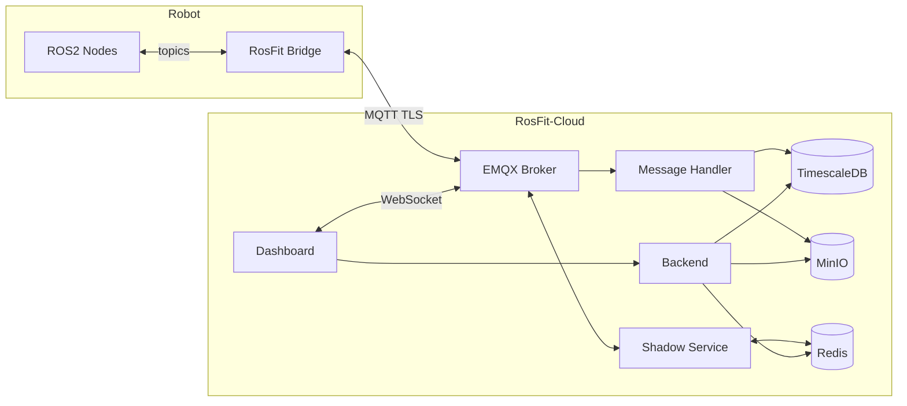

  

<h3 align="center">Connect your ROS2 robot to the cloud in minutes.</h3>

<i>
  MQTT bridge, real-time dashboard, remote commands, and OTA updates for your robot fleet. 
  Use <b>RosFit-Cloud</b> or <b>self-host</b> — zero vendor lock-in.
</i>

<!-- 

  <a href="https://github.com/rosfit/rosfit">Get Started</a> · <a href="https://rosfit.dev">Docs</a> · <a href="https://github.com/rosfit/rosfit/issues">Report Bug</a>

 -->

## The problem

You've built your robot. Now, you want your robot in the cloud. Telemetry, remote commands, config, firmware updates. 
You have two options: spend `3 months` implementing `MQTT`, `Auth`, and `Dashboards` from scratch, or spend 200+ per month per robot on a platform that controls your data. 
- **RosFit** is the third option. `Production-ready` cloud infrastructure for ROS2 robots, open source, deploy in minutes.

### What RosFit does

One YAML config and your robot become managable via cloud.

### Architecture

### MVP features

| Feature | What it does |
|---------|-------------|
| **MQTT Bridge** | Bridges ROS2 topics to MQTT with a YAML config — publish, subscribe, throttle |
| **Real-time Dashboard** | See all robots, status, telemetry charts — live via WebSocket |
| **Remote Commands** | Send commands from REST API or dashboard, get structured responses |
| **Device Shadow** | Desired vs reported config state — change robot settings without SSH |
| **OTA Updates** | Upload firmware, deploy to fleet with rollback on failure |
| **Token Auth** | JWT-based device and user authentication with per-device topic isolation |

### Roadmap

* **Phase 1** — Bridge + Dashboard + Commands *(in progress)*
* **Phase 2** — Shadow + OTA + Telemetry charts
* **Phase 3** — TLS, RBAC, alerts, webhooks
* **Phase 4** — RosFit Cloud (managed SaaS at `rosfit.dev`)
