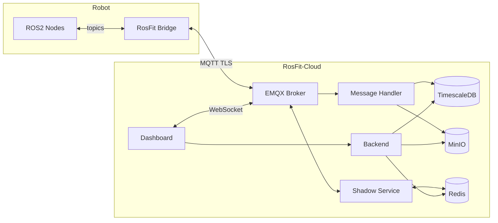

  

<h3 align="center">Fit your ROS2 robot into Cloud and control it from anywhere.</h3>

  Open-source bridge & management platform for connecting ROS2 robots to the cloud. 
  Self-hosted with Docker Compose. Zero custom code. Works in minutes.

  <a href="https://github.com/rosfit/rosfit">Get Started</a> · <a href="https://rosfit.dev">Docs</a> · <a href="https://github.com/rosfit/rosfit/issues">Report Bug</a>

---

### The problem

- Connecting a ROS2 robot to the cloud takes **months** of custom work — MQTT bridges, auth, dashboards, OTA pipelines, all built from scratch every time. 
- Existing platforms cost $200+/robot/month and lock you into their ecosystem.

### What RosFit does

One YAML config and your robot become managable via cloud.

### Architecture

### MVP features

| Feature | What it does |
|---------|-------------|
| **MQTT Bridge** | Bridges ROS2 topics to MQTT with a YAML config — publish, subscribe, throttle |
| **Real-time Dashboard** | See all robots, status, telemetry charts — live via WebSocket |
| **Remote Commands** | Send commands from REST API or dashboard, get structured responses |
| **Device Shadow** | Desired vs reported config state — change robot settings without SSH |
| **OTA Updates** | Upload firmware, deploy to fleet with rollback on failure |
| **Token Auth** | JWT-based device and user authentication with per-device topic isolation |

### Roadmap

* **Phase 1** — Bridge + Dashboard + Commands *(in progress)*
* **Phase 2** — Shadow + OTA + Telemetry charts
* **Phase 3** — TLS, RBAC, alerts, webhooks
* **Phase 4** — RosFit Cloud (managed SaaS at `rosfit.dev`)
